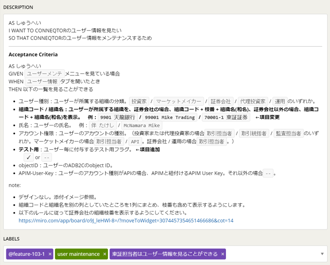

# ユーザーストーリー

## 概要
ユーザーストーリーとはユーザーの要求（誰が、どのような目的で、何をしたいのか）を表わすものです。  
ユーザーストーリーでは、ユーザーの要求を以下の形式で記載します。
```
As [ユーザー（ペルソナ）]
I want [ユーザーがしたいこと]
So that [結果として得られること]
```
また、ユーザーストーリーが達成していることを確認する基準（Acceptance Criteria）を以下の形で記載します。
```
Scenario:
Given [状況やコンテキスト]
When [アクション]
Then [結果]
```

バックログ管理するユーザーストーリーの例


## なぜユーザーストーリー?
ユーザーストーリーは、どのユーザーにどのような価値を提供するかを明確にすることができます。一つ一つの小さい価値を表すユーザーストーリーを利用することで、以下のメリットを得られます。
- 要件の変更に対しても柔軟に対応できる
- 都度チームで認識を合わせられる
- 手戻りがあっても最小で済む
- 開発順序を変更しやすい
- 頻繁にデプロイ/リリースできる

## ユーザーストーリーのポイント
- INVESTモデルに従う
  - **I**ndependent

    独立してリリースできるようにします。
    これにより優先順位を見直しやすくなります。
    ユーザーストーリー間で関連性がある場合、開発順序やリリース範囲について注意が必要となります。

  - **N**egotiable

    交渉によって内容を変更することを許容します。
    途中で要件の変更があった場合でも変化を受け入れ、チームメンバー全員で共有してユーザーストーリーの見直しを行います。

  - **V**aluable

    ユーザーに何らかの価値を提供するものにします。
    価値を提供しないものの開発者が作業する必要があるものは、ユーザーストーリーではなく、開発のための作業（chore）の一つとしてタスク管理します。
    また、ログ出力などシステム監視の機能については、運用担当者/システム管理者をペルソナとしてユーザーストーリーを作成します。

  - **E**stimatable

    開発者が複雑さを見積もることができる内容にします。
    開発者と意見を交えて、複雑さを見積もるのに必要な情報を記載します。

  - **S**mall

    価値を提供する、十分に小さいサイズのユーザーストーリーとします。
    プロジェクトやチームによりますが、十分に小さくすると1ストーリーを半日〜1日程度で完了できます。

  - **T**estable

    ユーザーストーリーが達成していることを確認する基準を明確にします。
    基準が明確に記述できない場合はユーザーストーリーのサイズが大きすぎる可能性があります。

- ユーザー視点で書く  

  ユーザーに価値を提供することに集中するよう、ユーザーストーリーにはユーザー視点で記載するようにし、プロダクトにおける実現方法に関わる内容は記載しません。システム構成、実装方法はユーザーストーリーを見て開発者が判断し実現します。  
  ただし、ユーザーストーリーが大き過ぎて開発を進めづらいなどの場合には、チーム内で実現方式について認識を合わせた上で、システムの構造に合わせてユーザーストーリーを小さく分割することも可能です。
  例えば、DBやキューへのデータ登録を行う機能とそのデータの参照を行う機能を２つのストーリーに分割して、DBへの登録を含めた方法で確認を行います。

- ペルソナを利用する  

  ユーザーストーリーの記述でペルソナを利用することで、チーム内で価値を提供するユーザーの認識を揃えることができます。また、具体的なユーザー像をイメージでき、ユーザー視点に立って開発を進めるのに役立ちます。

- 短くわかりやすいタイトルをつける  

  短くて誰が見てもわかるタイトルをつけることで、バックログ管理をしやすくなります。

- 説明に役立つ情報を付与する  

  言葉だけで説明が難しい場合、モックアップやワイヤーフレーム、ユーザーの業務フローなどをユーザーストーリーに添付/紐付けします。
  ユーザーストーリーを見るメンバーが共通の理解を得られるようにすることが重要です。
