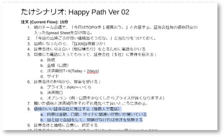

# シナリオ

## 概要

シナリオは、ターゲットユーザーがどのような流れでソフトウェアを利用するかを時系列で具体的に記入したものです。

シナリオは、以下のように作成します。
- もっとも基本的なシナリオ（happy path）を書く
  - レアケース、エラーケースはまずは不要
- 作業の起点と終点を意識して書く
  - なにがきっかけでシナリオがスタートするのか（before use）
  - どうなればゴールなのか、その後どうなるか（after use）
- シナリオ中、関わる関係者やタッチポイント（モノや情報）を意識して書く
- 流れが分かるように簡潔に書く
- ペルソナの気持ちがわかるように書く
- 現状「Current」と未来「Future」のシナリオを書くこともある

## シナリオのポイント

- UIの細かい挙動は書かなくてよい
  - Not good：  
    たけしが検索フィールドにユーザー名を入力すると、インクリメンタルサーチが走り、候補が絞り込まれる。対象ユーザーを選択し、「編集」ボタンを選択する。するとポップアップ画面が表示され情報を編集する。
  - Good：  
    たけしは、対象ユーザーを絞り込み、情報を編集する。
- シナリオを書くことで、新たなアサンプション、自分たちが知らない箇所、ペルソナの要求に気づくことがある
- ペルソナ同様、あらたな事実や誤りに気づいたら随時修正する

リサーチ計画立案
