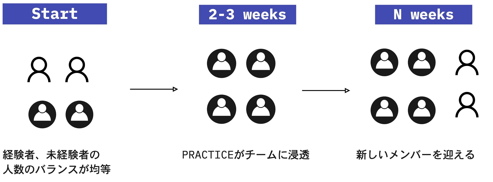
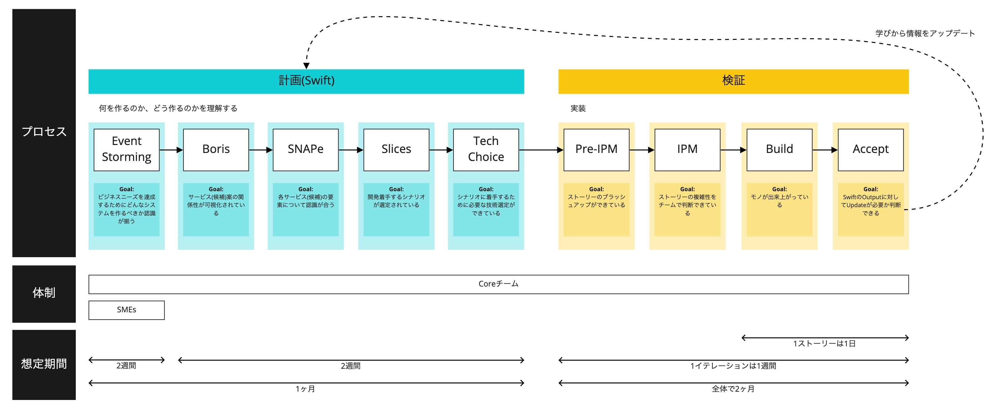

# Swift Method とは

## 背景
レガシーシステムをモダナイズする際に以下のような問題点に直面します。
- レガシーシステムについて知識のある人がいなくなっている
- 言語、テクノロジーが古く理解できない
- ソースコードのコメントや設計書等がメンテナンスされていない
- その場しのぎの技術負債が溜まっている
- どの機能が重要なのか、優先順位が分からない
- 要件が変わっている

このようなレガシーシステムのブラックボックス化が招く問題により、
メンテナンスや、新規要件への対応、影響調査が難しくなり、
必要のない資料、機能、プログラムの解析に時間を使うことになってしまいます。

これらに対応し、効率的にモダナイズする手法としてSwift Methodが有効となります。

Swift Methodは、ビジネスの視点をトップとしたトップダウンのアプローチです。  
エンジニアのみでなく、システムのユーザー、ビジネスモデルを理解している人と共に、
現在の問題、課題や今後の展望を含めたビジネスの状況からモダナイズについてディスカッションすることで、
重要な機能・優先順位が明確になります。さらに、ディスカッション中に知見が広がり、新しい要望が生まれることもあります。

## 概要
Swift Methodは、巨大で複雑な(モノリスな)システムを近代的なアーキテクチャで作り直す(モダナイズする)際に利用できるメソッドです。
漏れなく全ての機能をリプレースするのではなく、優先度の高い価値から順次リリースすることを目指します。

- 技術視点ではなく、ビジネスのあるべき姿から分析・理解を開始し、アジャイルプロセスを通してシステムを段階的に移行・開発する際に活用できます。
- DDD(Domain Driven Design)の原則に則ってビジネスの境界線を適切にシステムに反映させます。
- チームがソフトウェアシステムの最新化を開始するのに十分な計画を立てるのに役立ちます(リーンスタートアップ)。
- 必要なメンバー (エンジニア、システムのユーザー、ビジネスモデルを理解している人) が一緒になって作業します。

## Swift Methodの利点
- **業務ケースを共有できる、ユビキタス言語を形成できる**

  - EventStromingでビジネスイベントの洗い出しを行い、ユーザの業務ケースを共有するため、業務に対する理解を深めることができる
  - ユビキタス言語をまとめることで、顧客-開発チーム間での共通言語を形成することができるため、明確なコミュニケーションをとることができる
  - 追加の要件に対してもスムーズなやり取りができる

- **設計上で良いプロダクトになる**

  ドメインごとにサービス候補を挙げて仮説検証を繰り返すため、システム全体の見直しやシステムのあるべき姿をチーム内で認識を合わせることができます。

- **顧客、開発者間で信頼関係ができる**

  顧客と常に一緒に行動するため、顧客を含んだチームビルディング、顧客とのコミュニケーションの増加、プロダクトのビジョンを共有することができます。

- **システムの柔軟性が高くなる**

  開発を進めた後でも素早くサービスの見直しをすることができます。（途中変更への対応が比較的容易）

- **メンバーのイネーブルメントがしやすい**

  有識者とのペアリングやチーム活動を通して、学びを得て成長することができます。

- **優先度の高い機能を速く提供できる**

  エンジニア、システムのユーザー、ビジネスモデルを理解している人全員の認識を合わせ、不要な作業をすることなく、優先度が高い機能を速く提供することができます。

- **不要なやり取りがなくなる**

  顧客の実現したい機能について、技術的視点で実現可能性や難易度についてもディスカッションができるため、顧客とエンジニア間での認識齟齬を防ぐことができます。

## Swift Method適用時に考慮すべき点
- **顧客の時間調整**

  顧客に業務ケースのヒアリングなどを行うため、顧客の時間を調整しておかないといけません。  
  そのため、事前に顧客の参加が必要不可欠であることを合意しておくことやヒアリングの入念な事前準備が必要になります。

- **有識者・経験者のアサイン**

  - アジャイル開発経験者  
    ペアワークを前提として、チームメンバーの半分以上はアジャイル開発経験者をアサインするのが望ましいです。
  - DDD有識者  
    Swift Methodを通してサービス候補を挙げる際にDDDの知識が必要になるため、有識者のアサインが必要です。
  - 現行システム有識者  
    以下にあたって現行システム有識者が参画することが必要です。
    - モダナイゼーションを行う際の現行システムの機能と比較して抜け漏れ防止
    - サービス分割の検討にあたって、サブシステム間でどのようなデータが連携されているかの情報提供
    - ストーリーを記載する際の現行仕様の詳細な確認
  - ファシリテーター  
    チームでの話し合いの頻度が多いため、ファシリテートできる人が少ない、もしくは、ファシリテートできる人がいないとチームの意思決定がスムーズにできません。  
    そのため、ファシリテーションのポイントをメンバが押さえておくことや、チームメンバのファシリテーターに対する協力的な姿勢が必要になります。

- **スケール**
  - チームのスケール  
    Swift Methodの経験者・有識者が少ない状態で進めることがないよう、1チームから徐々に増やす方法が望ましいです。必要な体制までスケールさせるには労力と時間がかかります。

    

  - スコープのスケール  
    EventStormingで大きい粒度で業務フローを作ることで全体像を把握しておく必要があります。

- **マインドセット**

  良いプロダクトに作り、継続的にプロダクトを成長させ続けるために、チーム内のフラットな関係を保ち、チームで意思決定して、その中で学びを得て改善していきます。
  チームビルディングなどを通して時間をかけてこのようなマインドセットを形成し、チームの環境・活動の進め方に順応することが重要です。

- **情報共有のルール**

  コミュニケーションミスを防ぐために、チーム間/ステークホルダー間でどのように暗黙知の共有を行うかなど、ベースとなるコミュニケーションのルールを関係者で合意しておく必要があります。

- **現行資産の流用**

  現行資産を流用する場合、流用部分のテストや現行システムとの結合部分のテストの方針を検討する必要があります。

- **監査対応**

  アジャイル開発における監査方法について整備されていない可能性があるため、監査の対応方法について事前に顧客と認識を合わせる必要があります。

## 流れ

### 分析
1. [Event Storming](../eventstorming)  
   ビジネスニーズを達成するためにどんなシステムを作るべきか認識を揃えます
1. [Boris](../boris)  
   サービス(候補)間の関係性を可視化します
1. [SnapE](../snape)  
   各サービス(候補)の要素について認識を合わせます
1. [Slices](../slices)  
   開発着手するシナリオを選定します
1. [Tech Choice](../techchoice)  
   シナリオに着手するために必要な技術選定をします

### 開発
1. [Pre-IPM](../../../../team/activities/preipm)  
  Storyのブラッシュアップをします
1. [IPM](../../../../team/activities/preipm)  
  Storyの複雑性をチームで判断します
1. Build  
  モノを作り上げます
1. Accept  
  できたモノを確認しSwiftでのOutputに対してupdateの有無を判断します

開発の流れは[チームの働き方](../../../../team/workstyle/#イテレーション開発の基本的な考え方)に則ります。


**Tips**
- 気付き・学びがあれば随時前のStepに戻って見直します。
- 開発に入ってからも分析(Swift)で作成したものを継続して更新し続けます。
- Swift Methodは、VMware Tanzuにおいて過去の実績に基づいて、Event Stormingなどの複数のツールを集めて、モダナイズをする際の手法として定着させたものです。Boris、SnapEなどは独自にやり方を作り上げているため、インターネットで検索しても単語として出てきません。



**参考資料**
- [Tanzu Practices Swift Method](https://tanzu.vmware.com/developer/practices/swift-method/)


Event Storming
