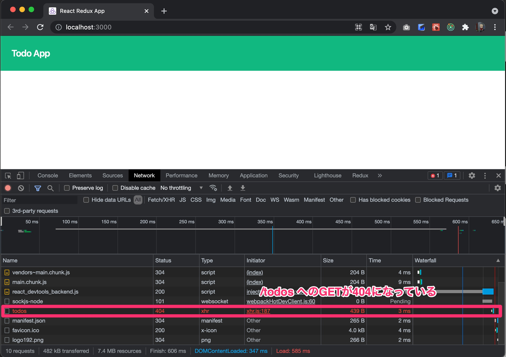
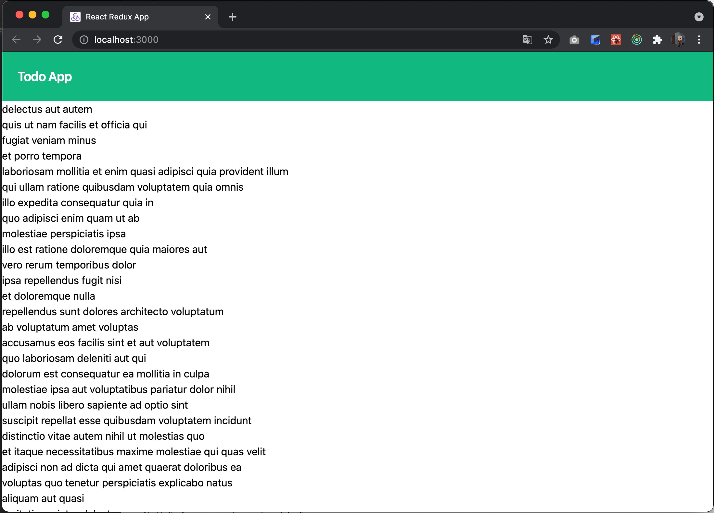

# ２日目

２日目はClientがServerに対してHTTPリクエストを実行するところ、そして、Serverの初期設定をして簡単なAPIを作って見るところをやってみましょう。
ここからだいぶ難しくなると思いますが、頑張っていきましょう。

## Reduxの導入

今回一番最初に`create-react-app`コマンドを実行したときtemplateにredux-typescriptをしていたのを覚えてますでしょうか。

```
npx create-react-app todo-app-client --template redux-typescript --use-npm
```

このtemplateにはすでに [redux-toolkit](https://redux-toolkit.js.org/) を使用するのに必要なモジュールが含まれています。
[redux](https://redux.js.org/) は状態管理のライブラリですが、
redux-toolkitはそれをReactで使用できるようにした [React-Redux](https://react-redux.js.org/) や、
reduxを便利に使用するための仕組みを同梱したものです。

Reduxについては公式のドキュメントを読んでください。Reduxは非常に難解なライブラリの1つですが、使いこなすと非常に強力です。
ドキュメントも非常に量が多いですが、この作業を始める前に最低限、以下を読んでおくことをおすすめします

- [https://redux.js.org/tutorials/essentials/part-1-overview-concepts](https://redux.js.org/tutorials/essentials/part-1-overview-concepts)
  - この記事を起因とする一連のRedux Essential
- [https://redux-toolkit.js.org/usage/usage-with-typescript](https://redux-toolkit.js.org/usage/usage-with-typescript)
- [https://redux.js.org/usage/writing-tests](https://redux.js.org/usage/writing-tests)
- [https://redux.js.org/style-guide/style-guide](https://redux.js.org/style-guide/style-guide)


**Reduxを最初から入れるべきか?**

Reduxを最初からいれるべきかどうかというのは非常に議論が分かれる部分ですが、筆者は **Reduxは最初から入れるべき** という考えです。
というのも、**どのようなアプリであっても遅かれ早かれスケールします。**

Reduxの導入を嫌煙する理由に導入コストが大きいというものがあります。
しかしRedux-Toolkitの登場によってRedux導入のコストはかなり低く、楽に導入できるようになりました。

ある程度アプリが大きくなった状態で後からReduxを入れるのはかなり作業量が大きくなり難しいです。
それなら最初からReduxを前提としてアプリを書いたほうがいいだろうという考えです。

Redux導入のコストは楽になりましたが、学習コストは依然として高いままです（これはReactも）。
導入の際はプロジェクトメンバに使い方を事前に学習してもらうなどして臨むようにすると良いでしょう。


## 非同期通信のテストと実装

### 非同期通信のテスト

まず、トップ画面を開いたらタスクの一覧を取得して、取得できたタスク一覧を表示するという機能を作ってみましょう。
Webブラウザには [fetchAPI](https://developer.mozilla.org/ja/docs/Web/API/Fetch_API) という機能があります。
ReactからfetchAPIを実行すると、指定したURLからリソースを取得することができます。

しかし、今回はこのfetchAPIはしようせず、 [axios](https://axios-http.com/) を導入します。
axiosはnode.jsのHTTP Clientです。axiosの類似のライブラリとしては [isomorphic-fetch](https://www.npmjs.com/package/isomorphic-fetch) などもあります。

なぜブラウザ標準のAPIを使用しないかというと以下の理由からです。

- ブラウザによってfetchの実装に差異がある
- ブラウザの実装をMockしてテストする難しさ

HTTP Clientをモックしてしまえば、どんなレスポンスもスタブとしてセットできるようになるので、開発がしやすくなります。

まずはaxiosとモックライブラリであるaxios-mock-adapterを導入しましょう。

```shell
npm install axios @types/axios
npm install --save-dev axios-mock-adapter
```

さて、テストの実装をしていく前に今回の機能を実現するAPIを軽く設計しないといけません。
ひとまず今回は`/todos`に対してGETすると以下のフォーマットのJSON文書が取得できるとします。

```json
[
  {
    "id": number,
    "title": string,
    "completed": boolean
  }
]
```

ルートが配列になっているJSONですね。エンベロープにくるむ(つまり最初にtodosのようなキーを作る)べきか、くるまない方がいいのかは議論が分かれるところですが、
筆者は後者の方ががいいと考えています。`GET /todos`というエンドポイントからTodoを一覧で取得できることが明確だからです。

さて、ではテストを書いていきましょう。
`__test__`配下にfeaturesというディレクトリを作成し、`TodoApi.test.ts`というファイルを作成し、最初のテストを実装していきます。

```typescript
// TodoApi.test.ts
import MockAdapter from 'axios-mock-adapter'
import axios from 'axios'
import {getTodos} from '../../features/TodoApi'

describe('TodoApi', () => {
  let mock: MockAdapter

  beforeEach(() => {
    mock = new MockAdapter(axios)
  })

  afterEach(() => {
    mock.reset()
  })

  it('get /todos', async () => {
    mock.onGet('/todos').reply(200, [
      {
        id: 1,
        title: 'title',
        completed: false,
      },
    ])

    const response = await getTodos()

    expect(mock.history.get[0].url).toEqual('/todos')
    expect(response[0].id).toEqual(1)
    expect(response[0].title).toEqual('title')
    expect(response[0].completed).toEqual(false)
  })
})
```

最初のテストはこのようにしました。axios-mock-adapterでHTTP通信をモックしており、
getTodo()を実行したときに、ちゃんと`/todo`に対してGetのリクエストをしていること。
戻り値のJSONのパースがうまくいっていることを確認しています。

### 非同期通信の実装

テストが実装できたら、これを実装してみましょう。
src配下にfeaturesというディレクトリを作成し、TodoApi.tsを作成します。

```typescript
// TodoApi.ts
import axios from 'axios'
import {Todo} from '../stores/todoSlice'

export const getTodos = async () => {
  const response = await axios.get<Todo[]>('/todos')
  return response.data
}
```

また、src配下のstoresに`todoSlice.ts`というファイルを作りましょう。いったん、Todoのインタフェースだけ定義してあげます。

```typescript
// todoSlice.ts
export interface Todo {
  id: number
  title: string
  completed: boolean
}
```

実装はこのようになりました。ひとまずこれでAPIのテストは通るはずです。
テストが通ったのを確認したら次のステップに行きましょう。

## Reducerのテストと実装

さて、APIの利用準備が整ったらReducerを作っていきましょう。ReducerとはReduxのStateを変更する関数のことです。
ReduxではStateを直接変更することは許されておらず、必ずReducerを通じて変更しなければなりません。

先程、Todo一覧をGetする非同期処理を実装しましたが、その非同期処理を呼び、戻り地をStateに反映する処理を実装してみましょう。

### Reducerの登録

Redux-ToolkitではSliceという概念があります。これはStateとReducerを一纏めにしたものだと考えてください。
まず、Reducerを作ります。

先程作成したtodoSlice.tsに以下のように変更してください。

```typescript
// todoSlice.ts
import {createAsyncThunk, createSlice} from '@reduxjs/toolkit'

export interface Todo {
  id: number
  title: string
  completed: boolean
}

export const todoSlice = createSlice({
  name: 'todos',
  initialState: [] as Todo[],
  reducers: {},
})

export default todoSlice
```

ひとまず機能は実装せず、StateとしてTodo[]の配列を保持するという設定だけ入れました。
その上で、store.tsにこれを登録してあげます。

```typescript
// store.ts
import {configureStore, ThunkAction, Action} from '@reduxjs/toolkit'
import todoSlice from './todoSlice'   // 追記

export const store = configureStore({
  reducer: {
    todos: todoSlice.reducer,     // 追記
  },
})

export type AppDispatch = typeof store.dispatch
export type RootState = ReturnType<typeof store.getState>
export type AppThunk<ReturnType = void> = ThunkAction<
        ReturnType,
        RootState,
        unknown,
        Action<string>
        >
```

これでReducerを使う準備が整いました。ではテストを書いていきましょう。

### Reducerのテスト

`__tests__`配下に`store`ディレクトリを作成し、`todoSlice.test.ts`を作成してください。
Reducerは **変更前のStateに対して、Actionを実行し、変更後のStateを返す** 純粋な関数ですのでテストは非常に簡単に書くことができます。

```typescript
// todoSlice.test.ts
import todoSlice, {getTodoAction} from "../../stores/todoSlice";

describe("todo reducer", () => {
  it("initial state", () => {
    expect(todoSlice.reducer(undefined, {type: undefined})).toEqual([])
  })

  it('get todo is pending', async () => {
    const action = {type: getTodoAction.pending.type}
    const state = todoSlice.reducer([], action)
    expect(state.length).toEqual(0)
  })

  it('get todo is fulfilled', async () => {
    const action = {
      type: getTodoAction.fulfilled.type, payload: [{
        id: 1,
        title: 'hoge',
        completed: false
      }]
    }

    const state = todoSlice.reducer([], action)
    expect(state.length).toEqual(1)
    expect(state[0].id).toEqual(1)
    expect(state[0].title).toEqual('hoge')
    expect(state[0].completed).toEqual(false)
  })

  it('get todo is rejected', async () => {
    const action = {type: getTodoAction.rejected.type}
    const state = todoSlice.reducer([], action)
    expect(state.length).toEqual(0)
  })
})
```

4つのテストを実装しました。
最初のテストはSliceを作ったとき最初の初期状態が空の配列になることを確認しています。

残る3つはGet /Todoの非同期処理に関わるテストで上から順番に

- 非同期処理が実行中はStateの状態は変化しない
- 非同期処理が完了したら取得した内容がそのままStateに反映される
- 非同期処理がエラーだったらStateの状態は変化しない

ことを確認しているテストです。ここまで大丈夫でしょうか。

pending、fulfilled、rejectedとは？となるかもしれませんが、
これはRedux-Toolkitで非同期処理を実装するのに使う、
[createAsyncThunk](https://redux-toolkit.js.org/api/createAsyncThunk) が自動で作成してくれるActionです。
今回はgetTodoActionという名前のアクションを作成することにしました。

このgetTodoActionはまだ実装されてませんが、先程featureに実装したAPIを呼び出すものになるのは明白ですので、
`createAsyncThunk`を使用する前提でテストを記述しています。

わからない所があれば都度公式のリファレンスやドキュメントを読んで理解してください。

### Reducerの実装

それではReducerを実装してみましょう。ReduxのReducerでは通常副作用のある（つまりasync/awaitを含むような）処理を記述することはできません。
そこで、使われるのが [redux-thunk](https://github.com/reduxjs/redux-thunk) というmiddlewareです。
createAsyncThunkを使うとThunkを使った処理が簡単に記述できます。

```typescript
// todoSlice.ts
import {createAsyncThunk, createSlice} from '@reduxjs/toolkit'
import {getTodos} from '../features/TodoApi'

export interface Todo {
  id: number
  title: string
  completed: boolean
}

export const getTodoAction = createAsyncThunk<Todo[]>(
        'get /todos',
        async (): Promise<Todo[]> => getTodos()
)

export const todoSlice = createSlice({
  name: 'todos',
  initialState: [] as Todo[],
  reducers: {},
  extraReducers: (builder) => {
    builder.addCase(getTodoAction.fulfilled, (state, action) => action.payload)
  },
})

export default todoSlice
```

getTodoActionはこのように実装しました。
```typescript
export const getTodoAction = createAsyncThunk<Todo[]>(
        'get /todos',
        async (): Promise<Todo[]> => getTodos()
)
```

createAsyncThunkで非同期のActionを作成し、その中で先程作ったgetTodo()を呼んでPromise<Todo[]>を返却するようにしています。
作成したアクションをextraReducers（reducersではないので注意）に登録しているのが以下の部分です。
```typescript
export const todoSlice = createSlice({
  name: 'todos',
  initialState: [] as Todo[],
  reducers: {},
  extraReducers: (builder) => {
    builder.addCase(getTodoAction.fulfilled, (state, action) => action.payload)
  },
})
```

getTodoActionが正常に完了したときに新しいアクションをどうするかを記載しています。
ここではstateがどのような状態であれ、getTodo()の戻り値(つまりaction.payload)を新しいstateとして返却するとしました。
ひとまず、現状テストは通っているはずです。

これでReducerの実装は終わりました。次に作成したSliceを使ってコンポーネントの描画をしてみましょう。

## タスク一覧表示コンポーネントのテストと実装

Reduxを使うことによる最大の利点はコンポーネント間の依存を小さくし、
**各コンポーネントを非常にシンプルな状態に保つことができること** です。

これからタスク一覧のコンポーネントを作成しますが、このコンポーネントはStateの状態にしたがって画面を描画するだけになります。
すなわちテストの実装も非常に簡単です。

### タスク一覧表示コンポーネントのテスト

__tests__/components配下にTodoList.test.tsxを作成しましょう。

```typescript jsx
//TodoList.test.tsx
import {cleanup, screen, render} from '@testing-library/react'

describe('TodoList Component', () => {
  afterEach(() => {
    cleanup()
  })

  it('ステートが空ならリストも空', () => {
    render(<TodoList />)
    expect(screen.getByRole('list').hasChildNodes()).toEqual(false)
  })
})
```

最初のテストはこのようにしてみました。これを実行してみましょう。
TodoListはまだ実装されていませんので、当然失敗するはずです。

```
 FAIL  src/__tests__/components/TodoList.test.tsx
  ● TodoList Component › ステートが空ならリストも空

    ReferenceError: TodoList is not defined

      19 |   // })
      20 |   it('ステートが空ならリストも空', () => {
    > 21 |     render(<TodoList />)
         |             ^
      22 |     expect(screen.getByRole('list').hasChildNodes()).toEqual(false)
      23 |   })
      24 | })

      at Object.<anonymous> (src/__tests__/components/TodoList.test.tsx:21:13)
```

### タスク一覧表示コンポーネントの実装

ではコンポーネントを実装していきましょう。src/components配下にTodoList.tsxを作成します。

```typescript jsx
// TodoList.tsx
import {useSelector} from 'react-redux'
import {RootState} from '../stores/store'

const TodoList = () => {
  const todos = useSelector((state: RootState) => state.todos)

  return (
          <ul>
            {todos.map((todo) => (
                    <li key={todo.id}>{todo.title}</li>
            ))}
          </ul>
  )
}

export default TodoList
```

useSelectorはReduxのStateから情報を引き出す処理です。ここではstate.todosを読み込んでます。
読み込んだtodosは配列ですので、1件ずつ表示しているだけです。
コンポーネントが非常にシンプルになっているかとおもいます。

### Redux Connected Componentsのテスト

さて、コンポーネントの実装は終わったので、これをテストしてみましょう。
先程作成した、`TodoList.test.tsx`に`import TodoList from "../../components/TodoList";`を加えてテストを実行してみましょう。

どうでしょう、成功したと思いきやまだ失敗しています。
これはなぜかというと、このTodoListComponentは他のコンポーネントには依存してませんが、ReduxのStateに依存してますよね。

一度index.tsxを見てみましょう。

```typescript jsx
import {StrictMode} from 'react'
import ReactDOM from 'react-dom'
import {Provider} from 'react-redux'
import './index.css'
import App from './App'
import {store} from './stores/store'

ReactDOM.render(
  <StrictMode>
    <Provider store={store}>
      <App />
    </Provider>
  </StrictMode>,
  document.getElementById('root')
)
```

`<Provider store={store}>`という記述があると思いますが、これが非常に重要で、
この記述があるおかげで、App以下のコンポーネントはReduxのStoreを使うことができます。

しかし、現在の`TodoList.test.tsx`に実装したテストではその依存関係を無視して、`render(<TodoList />)`と、TodoListのみを直でレンダリングしてます。
なので、storeが使えずエラーになっているわけです。

これを解消するための方法は、公式のドキュメントにしっかり記載があり、
[ReactTestingLibraryのRender関数をカスタマイズした独自のRender関数を作ることで対処](https://redux.js.org/usage/writing-tests#components) します。

src直下にtest-utils.jsxを作成します。
```javascript
// test-utils.jsx
import {render as rtlRender} from '@testing-library/react'
import {configureStore} from '@reduxjs/toolkit'
import {Provider} from 'react-redux'
import todoSlice from './stores/todoSlice'

function render(
        ui,
        {
          preloadedState,
          store = configureStore({
            reducer: {todos: todoSlice.reducer},
            preloadedState,
          }),
          ...renderOptions
        } = {}
) {
  function Wrapper({children}) {
    return <Provider store={store}>{children}</Provider>
  }
  return rtlRender(ui, {wrapper: Wrapper, ...renderOptions})
}

export * from '@testing-library/react'
export {render}
```

ソースコード見ていただけるとわかると思いますが、公式のドキュメントに記載されてる関数ほぼそのままです。

このrender関数のいい所はpreloadStateにStateの初期状態を設定できるところです。
ではこのrender関数をつかって`TodoList.test.tsx`を書き直してみましょう。

```typescript jsx
// TodoList.test.tsx
import {cleanup, screen} from '@testing-library/react'
import {render} from '../../test-utils'
import TodoList from "../../components/TodoList";

describe('TodoList Component', () => {
  afterEach(() => {
    cleanup()
  })

  it('ステートが空ならリストも空', () => {
    const initialState = {todos: []}
    render(<TodoList />, {preloadedState: initialState})
    expect(screen.getByRole('list').hasChildNodes()).toEqual(false)
  })

  it('リストアイテムを表示する', () => {
    const initialState = {todos: [{id: 1, title: 'hoge', completed: false}]}
    render(<TodoList />, {preloadedState: initialState})
    expect(screen.getByRole('listitem').textContent).toEqual('hoge')
  })
})
```

このコンポーネントはStateの件数に応じてリストを表示しているだけですので、現状このぐらいのテストで十分でしょう。
これでテストが通っていたらひとまず大丈夫です。

## ホーム画面への組み込み

Stateの状態に応じてタスクを表示するコンポーネントはできましたが、肝心の画面への組み込みができていませんし、
作成したActionを呼び出すこともしてませんので、これをやっていきましょう。

### ホーム画面のテスト

ホーム画面を表示したらgetTodoActionを実行するという処理を実装してみましょう。

```typescript jsx
// Home.test.tsx
import {cleanup, screen} from '@testing-library/react'
import MockAdapter from 'axios-mock-adapter'
import axios from 'axios'
import {render} from '../../test-utils'
import Home from '../../pages/Home'

describe('Home画面', () => {
  let mock: MockAdapter

  beforeEach(() => {
    mock = new MockAdapter(axios)
  })

  afterEach(() => {
    mock.reset()
    cleanup()
  })

  it('ホーム画面の初期表示', async () => {
    mock.onGet('/todos').reply(200, [
      {
        id: 1,
        title: 'title',
        completed: false,
      },
    ])
    const initialState = {todos: []}
    render(<Home />, {preloadedState: initialState})

    expect(mock.history.get[0].url).toEqual('/todos')
    expect(screen.getByText('title')).toBeInTheDocument()
  })
})
```

作成したテストはこのようなものです。元々あったホーム画面の初期表示のテストを拡充しました。
このHomeもReduxのStoreに依存することになるため、**renderの関数をtest-utils.jsで実装したrenderに変更するのを忘れないでください。**

また、APIのテストを実装するときに使用したaxios-mock-adapterが再び登場しました。
Sliceはモックしておらず、本物のtodoSliceを使用しているのが非常に大事で、要はインテグレーションテストになっています。

なぜSliceをモックせずHTTP Clientだけをモックしているかというと、
[公式のドキュメントがそれを推奨している](https://redux.js.org/usage/writing-tests#action-creators--thunks) からです。
Reducerをモックして実施するComponentのテストに果たして意味があるのかということですね。

### ホーム画面の実装

ホーム画面を表示したあと、副次的な処理としてgetTodoActionを実行するということでReactの`useEffect()`を使えば良さそうです。
useEffect()については [https://ja.reactjs.org/docs/hooks-effect.html](https://ja.reactjs.org/docs/hooks-effect.html) を読みましょう。

```typescript jsx
// Home.tsx
import {useEffect} from 'react'
import {useDispatch} from 'react-redux'
import Header from '../components/Header'
import TodoList from '../components/TodoList'
import {AppDispatch} from '../stores/store'
import {getTodoAction} from '../stores/todoSlice'

const Home = () => {
  const dispatch: AppDispatch = useDispatch()

  useEffect(() => {
    dispatch(getTodoAction())
  })

  return (
          <div>
            <Header />
            <TodoList />
          </div>
  )
}

export default Home
```

useEffect()内で、getTodoAction()をDispatchしています。
DispatchはActionを実際に発行する処理です。
さらにHeaderの下に先程作成したTodoListコンポーネントを組み込みました。

これでどうでしょうか？テストは通りますでしょうか？

```
      30 |     expect(screen.getByText("Todo App")).toBeInTheDocument()
      31 |     expect(mock.history.get[0].url).toEqual('/todos')
    > 32 |     expect(screen.getByText('title')).toBeInTheDocument()
         |                   ^
      33 |   })
      34 | })
      35 |

      at Object.getElementError (node_modules/@testing-library/react/node_modules/@testing-library/dom/dist/config.js:34:12)
      at node_modules/@testing-library/react/node_modules/@testing-library/dom/dist/query-helpers.js:71:38
      at getByText (node_modules/@testing-library/react/node_modules/@testing-library/dom/dist/query-helpers.js:54:17)
      at Object.<anonymous> (src/__tests__/pages/Home.test.tsx:32:19)

Test Suites: 1 failed, 4 passed, 5 total
Tests:       1 failed, 8 passed, 9 total
Snapshots:   0 total
Time:        1.989 s, estimated 2 s

```

どうにもおかしいですね。/todosにちゃんとGetのリクエストは行っていて、Getのレスポンスの内容もMockされています。
なのに、画面にはまだそれが反映されていないようです。

これは非同期処理特有の罠で、APIへの応答はMockしているのですが、
APIリクエストの戻り値はPromiseで、それがまだペンディングの状態になっており処理を堰き止めています。
つまりGETのリクエストを投げて、その応答がまだ帰ってきていない状態になっているということです。

ですので、ペンディングになっているPromiseを完了させる必要があります。
大した処理ではないので自前で実装してもいいでのすが、ここでは [flush-promises](https://www.npmjs.com/package/flush-promises) というライブラリを使ってしまいます。

```shell
npm install --save-dev flush-promises
```

flush-promisesが導入できたら、Home.test.tsxを少し編集しましょう。

```typescript jsx
// Home.test.tsx
import {cleanup, screen} from '@testing-library/react'
import MockAdapter from 'axios-mock-adapter'
import axios from 'axios'
import flushPromises from 'flush-promises'    // 追記
import {render} from '../../test-utils'
import Home from '../../pages/Home'

describe('Home画面', () => {
  let mock: MockAdapter

  beforeEach(() => {
    mock = new MockAdapter(axios)
  })

  afterEach(() => {
    mock.reset()
    cleanup()
  })

  it('ホーム画面の初期表示', async () => {
    mock.onGet('/todos').reply(200, [
      {
        id: 1,
        title: 'title',
        completed: false,
      },
    ])
    const initialState = {todos: []}
    render(<Home />, {preloadedState: initialState})

    expect(screen.getByText("Todo App")).toBeInTheDocument()
    expect(mock.history.get[0].url).toEqual('/todos')
    await flushPromises()     // 追記
    expect(screen.getByText('title')).toBeInTheDocument()
  })
})
```

`await flushPromise()`を実行すると、堰き止められていたPromiseが動き出します！

```
 PASS  src/__tests__/features/TodoApi.test.ts
 PASS  src/__tests__/components/TodoList.test.tsx
 PASS  src/__tests__/pages/Home.test.tsx
 PASS  src/__tests__/components/Header.test.tsx
 PASS  src/__tests__/stores/todoSlice.test.ts

Test Suites: 5 passed, 5 total
Tests:       9 passed, 9 total
Snapshots:   0 total
Time:        1.847 s, estimated 2 s
Ran all test suites related to changed files.
```

テストが全件通りました！ひとまずこれでクライアントの実装は完了です。
ここまでのソースコードは
[https://github.com/Onebase-Fujitsu/todo-app-client/tree/step4](https://github.com/Onebase-Fujitsu/todo-app-client/tree/step4)
に置いてあります。

ここは慣れていないと非常に難しい部分だと思いますので、
公式のリファレンスを参考にしながら少しずつトライしてみましょう。

## クライアントの動作確認

さてクライアントの実装は終わりましたが、`npm run start`を実行して`http://localhost:3000`にアクセスしても、
1日目の実装結果となにも変わりありませんよね。



しかし、Chromeの開発者ツールをつかって画面表示に際して発生したトラフィックを見てみると、
ちゃんと/todoに対してリクエストを行っている様子が確認できます。
まだサーバが実装されていませんので、まだ404になるのは当然ですね。

しかし、このままだとちゃんとクライアントの実装ができてるか少し不安だと思うので、ちょっとしたツールをご紹介します。
[JSON Placeholder](https://jsonplaceholder.typicode.com/) というサービスがあります。

これは予め定義されたJSONを返してくれるサービスで、
例えば [https://jsonplaceholder.typicode.com/todos](https://jsonplaceholder.typicode.com/todos) にアクセスすると、
200件のTodoをJSONで返してくれます。

TodoApi.tsを開いてリクエスト先のURLを一時的に変更してみましょう。

```typescript
// TodoApi.ts
import axios from 'axios'
import {Todo} from '../stores/todoSlice'

export const getTodos = async () => {
  // const response = await axios.get<Todo[]>('/todos')
  const response = await axios.get<Todo[]>('https://jsonplaceholder.typicode.com/todos')
  return response.data
}
```

この状態で再びhttp://localhost:3000を開くと文字列がズラズラ表示されます！



よくみると、これは 
[https://jsonplaceholder.typicode.com/todos](https://jsonplaceholder.typicode.com/todos)
が応答してるjsonのtitle部分になっていることがわかると思います。

正しく処理されていそうですね！

JSON Placeholderは予め定義されているJSONの他にも自分で作成したJSONを応答させるようにすることもできます。
サーバの実装は当分先だけどClientだけどうなるか見たいというときはこういったサービスを活用するといいですね。

正しく動作していることが確認できたら再びリクエスト先を/todosに戻しておいてください。
次はサーバの実装をやってみましょう。

