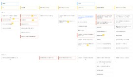

# ユーザーストーリーマッピング

## 概要
ユーザーストーリーマッピングでは、ユーザーストーリーを抽出しながら、ユーザーのアクション（横軸）、優先度（縦軸）によってマッピングを行い、ユーザーストーリーを整理します。

1. 各ユーザー（ペルソナ）が利用する際のアクションを書き出す
1. 各アクションで必要となる詳細な要求（ユーザーストーリー）を書き出す
   > **ユーザーストーリー抽出観点の例**
   > - 画面で見ることができる項目
   > - 画面の操作内容
   > - 画面で指定する入力項目
   > - 画面に表示する順序
1. 各ユーザーストーリーについて優先度でマッピングする
   > **優先度の観点の例**
   > - must have（ないと困る）
   > - good to have（あった方が良い）
   > - nice to have（あるとさらにUXに効果的）
   > - edge case

   > **優先度付けの結果としてのリリース例 (ユーザーの決済)**
   > - リリース１：クレジットカード決済のみ
   > - リリース２：PayPayなどのキャッシュレス決済の追加

## なぜユーザーストーリーマッピング？
ユーザーストーリーマッピングは、ユーザーがプロダクトを利用する流れと、ユーザーストーリー単位での開発対象、優先度の全体像を可視化して、チーム内で認識を揃えることを目的としています。
また、ユーザーストーリーマッピングは、今後のリリース計画についてどの機能までをリリースするかの整理、ユーザーストーリーにおける抜け漏れへの気付き、新しいアイデアの抽出、に有効です。

## ユーザーストーリーマッピングのポイント
- ユーザーストーリーの記載粒度を揃える

  粒度を揃えることで、機能間を横並びで比較しやすく、また、全体像を理解しやすくなります。

- ユーザーストーリーを適度に分類する

  基本的にユーザーストーリーマッピングでは、ユーザー（ペルソナ）、及び、そのユーザーのアクションによって、横軸に分類を行います。ただし、ユーザーストーリーが増えるにつれて全体像の把握が難しくなってしまうため、横軸の分類を詳細化する（大分類/中分類/小分類）、各ユーザーストーリーの付箋にタグ付けしてグルーピングする、ユーザーストーリーマップ自体を複数に分割する、など適度に分類して見やすくすることが有効です。

- 自信度が高いものをユーザーストーリーとして抽出する

  思い込みのみでユーザーストーリーを記載することがないよう、ユーザーへのヒアリングなどで収集した情報に基づいて自信度が高いものをユーザーストーリーとして抽出してマッピングします。

- モックアップやプロトタイプを利用する

  ユーザーへのヒアリングなどにおいてモックアップやプロトタイプを作成済の場合、それらを見ながら必要な情報を洗い出すことで、ユーザーストーリーの抜け漏れの防止に繋がります。

- 優先度を判断できる人やユーザーのことをよく理解している人と一緒に作成する

  整理を進めるなかで気付きを得ながら、ユーザーストーリーを抽出したり優先付けしたりするため、必要な情報を持っているメンバー、優先度の判断ができるメンバーが一緒になって作業をすることで効率的に進められます。
  ProductManagerとDesigner、また、必要であればDeveloperと一緒に実施することで、各観点で抜け漏れが少なくなったりその場で認識を合わせられたりします。
