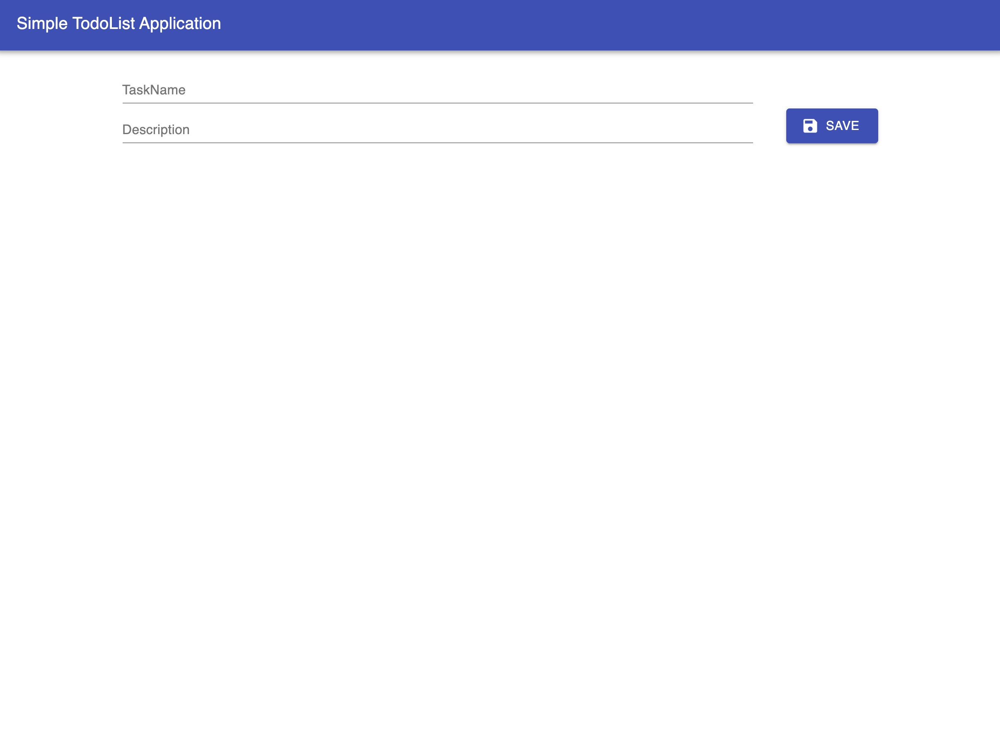

# テストダブル

テスト駆動開発の開発の流れがわかってきたところで、次にテストダブルを使用したテストについて学んでいきましょう。

## テストダブルとは

テスト対象となるクラスやメソッドが、ほかのクラスに依存していないケースはほとんどありません。
依存しているクラスもまた、ほかのクラスに依存しています。

ソフトウェアは多数のクラスが依存し合って動作するため、クラス単体の動作を保証するよりも、ソフトウェア全体の動作を保証するほうが価値が高くなります。
一方、テスト対象クラス以外の問題を原因として、ユニットテストが失敗する可能性があることは大きなデメリットです。

テストが失敗したときには、最初にテスト対象クラスに問題があると考えるため、原因の分析に余計な時間がかかります。
また、依存する機能が外部サービスや乱数、システム時間など、期待する結果を予測できない場合には検証の精度を落とさざるを得ません。

そこで、依存する機能がユニットテストで扱いづらい場合や、ユニットテストの独立性を高めたい場合には、依存するオブジェクトを「代役」で置き換える方法が有効です。
この代役となるオブジェクトはスタブやモックとして知られ、総称してテストダブル（TestDouble）と呼ばれます。

テストダブルには様々なパターンがあります

* Stub
  * テスト対象の依存オブジェクトに予測可能な振る舞いをする
* Spy
  * テスト対象から依存オブジェクトへの呼び出しを監視する
* Mock
  * テスト対象から依存オブジェクトへの呼び出しを検証する
* Fake
  * テストの範囲内で本物と同じように動作する
* Dummy
  * 内部のパラメータや状態がなんでもあってもテストに影響を及ぼさない代替オブジェクト

FakeとDummyは本物と同じように振る舞う偽のオブジェクトであったり、コンパイルを通すために実装される代替オブジェクトなので、
説明はここでは割愛します。ここではStub、Mock、Spyについて説明していきます。

### Stub

スタブとは依存するクラスやモジュールの代用として使用する仮のクラスやモジュールです。
ユニットテストに置いてはは依存オブジェクトに予測可能な振る舞いをさせる目的で使用されます。
その他にも依存オブジェクトの実行コストが高く、簡単に利用できない場合などに使われます。

## テストダブルを実現するライブラリ

テストダブルを実現するライブラリも様々なものがあります。
Javaですと [Mockito](https://site.mockito.org/)、 [EasyMock](https://easymock.org/) 、
[jMock](http://jmock.org/) あたりでしょうか。
Javascriptだと [Sinon.js](https://sinonjs.org/) や [testdouble.js](https://github.com/testdouble/testdouble.js/) が有名です。


## サンプルアプリケーション

さて、ここからは具体的なアプリケーションをつかってテストの実装をやってみましょう。

サンプルアプリケーションは [ここ](https://github.com/Onebase-Fujitsu/simple-todo-app) で公開してあります。

[https://github.com/Onebase-Fujitsu/simple-todo-app](https://github.com/Onebase-Fujitsu/simple-todo-app)

まずはリポジトリをローカルにCloneしてみましょう。
CloneしたらTerminalを2つ立ち上げて、フロントエンドとバックエンドを起動してみてください。
実行にはJavaの実行環境と、Node.jsの実行環境が必要です。

リポジトリのClone
```shell
git clone https://github.com/Onebase-Fujitsu/simple-todo-app.git
```

フロントエンドの起動(Mac/Linuxの場合)
```shell
cd client
npm install
npm run start
```

フロントエンドの起動(Windowsの場合)
```shell
chdir client
npm install
npm run start
```

バックエンドの起動(Mac/Linuxの場合)
```shell
cd sever
SERVER_PORT=8080 ./gradlew bootRun
```

バックエンドの起動(Windowsの場合)
```shell
chdir server
SERVER_PORT=8080
gradlew.bat bootRun
```

まずは、このアプリケーションを動かしてみましょう。このアプリケーションはシンプルなToDo管理アプリケーションです。
Cliantは [React](https://ja.reactjs.org/) で作っていて、開発言語に [Typescript](https://www.typescriptlang.org/) を使用しています。
またUIライブラリに [Material-UI](https://material-ui.com/) を採用しています。

Serverは [Spring Boot](https://spring.io/) で作っており、開発言語は [Java](https://www.java.com/ja/) です。
DBは [H2 Database](https://www.h2database.com/html/main.html) をインメモリで動かしています。
またDBのマイグレーションの [Flyway](https://flywaydb.org/) を使用しているのが一つポイントです。

正常に起動してWebブラウザで [http://localhost:3000](http://localhost:3000) にアクセスするとこのような画面が表示されるはずです。



タスク名や説明を入力してSaveをクリックすると、タスクが保存されますし、
ブラウザをリロードしても状態が保存されていることがわかると思います。


タスクを完了したり、ゴミ箱ボタンをクリックすると削除したりすることができます。 
さて、このアプリケーションのServerのテストを見てみましょう。

[https://github.com/Onebase-Fujitsu/simple-todo-app/tree/main/server/src/test](https://github.com/Onebase-Fujitsu/simple-todo-app/tree/main/server/src/test)

見てもらえると分かりますが、このアプリケーションにはテストが実装されていません。
ということで一緒にハンズオン形式でテストを実装してみましょう。

## Mockitoを使ったControllerのユニットテスト

Spring Bootアプリケーションを新規に作るときは [spring initializr](https://start.spring.io/) を使うんですが、
テストのために必要な様々なライブラリはデフォルトでついてきます。

[build.gradle](https://github.com/Onebase-Fujitsu/simple-todo-app/blob/main/server/build.gradle)
を見ると以下のような設定パラメータを見ることができます。

```gradle
dependencies {
	implementation 'org.springframework.boot:spring-boot-starter-jdbc:2.5.3'
	implementation 'org.springframework.boot:spring-boot-starter-web:2.5.3'
	implementation 'com.h2database:h2:1.4.200'
	implementation 'org.flywaydb:flyway-core:7.12.1'
	testImplementation 'org.springframework.boot:spring-boot-starter-test:2.5.3'
}
```

この中の`testImplementation 'org.springframework.boot:spring-boot-starter-test:2.5.3'`がSpring Bootアプリケーションに必要な様々な機能を提供しているライブラリです。
テストダブルを使ったテストを実現するライブラリ`Mockito`もこの中に含まれています。

### バックエンドの構造

さて、次にバックエンドの作りを見てみましょう。
バックエンドは極々一般的な3層アーキテクチャになっています。
バックエンドは極々一般的な3層アーキテクチャになっています。


classDiagram
class TodoAppController{
  TodoAppService todoAppService
  getAllTasks() List~Task~
  createTask(NewTask newTask) void
  finishTask(int taskId) void
  revertTask(int taskId) void
  deleteTask(int taskId) void
}
class TodoAppService{
  getAllTasks() List~Task~
  createTask(NewTask newTask) void
  finishTask(int taskId) void
  revertTask(int taskId) void
  deleteTask(int taskId) void
}
class TodoAppServiceImpl{
  TodoAppRepository todoAppRepository
  getAllTasks() List~Task~
  createTask(NewTask newTask) void
  finishTask(int taskId) void
  revertTask(int taskId) void
  deleteTask(int taskId) void
}
class TodoAppRepository{
getAllTasks() List~Task~
createTask(NewTask newTask) void
finishTask(int taskId) void
revertTask(int taskId) void
deleteTask(int taskId) void
}
class TodoAppRepositoryImpl{
  JdbcTemplate jdbcTemplate;
  getAllTasks() List~Task~
  createTask(NewTask newTask) void
  finishTask(int taskId) void
  revertTask(int taskId) void
  deleteTask(int taskId) void
}
TodoAppController ..> TodoAppService
TodoAppServiceImpl ..|> TodoAppService
TodoAppServiceImpl ..> TodoAppRepository
TodoAppRepositoryImpl ..|> TodoAppRepository


TodoAppControllerはTodoAppServiceに依存していて、TodoAppServiceはTodoAppRepositoryに依存しています。
TodoAppServiceとTodoAppRepositoryはinterfaceです。これは [依存性逆転の原則(DIP)]() に従ったです。
抽象に依存するようにして結合度を下げています。これについては後述します。

### 最初のテスト

では早速getAllTask()のテストを書いていきましょう。
getAllTasks()はタスクを全県取得するメソッドです。
まずはタスクが0件のときに空の配列を返すということを確認するテストを書いていきましょう。

`server\src\test\java\com.example.todoApp`配下に`controller`パッケージを新規に作成し`TodoAppControllerUnitTest.java`を作りましょう。

```java
// TodoAppControllerUnitTest.java
import org.junit.jupiter.api.Test;
import org.junit.jupiter.api.extension.ExtendWith;
import org.springframework.test.context.junit.jupiter.SpringExtension;

@ExtendWith(SpringExtension.class)
public class TodoAppControllerUnitTest {
    
}
```
まずは雛形。
`@ExtendWith(SpringExtension.class)`という見慣れない記述がありますが、これはJUnit5上でSpring TestContext Frameworkを使用できるようにしているクラスです。
最初はおまじないだと思ってください。

さて、実際のプロダクトの実装ではServiceは実装されているのですが、ここで実装したいのはControllerの単体テストです。
ちゃんとControllerがServiceを呼んでいるよねという確認や、Serviceからの戻り値に応じた返却をしているよねという検証をしたいです。
ということで、ここでは本物のTodoAppServiceではなく、Serviceの代わりに成り代わって呼び出しの検証や、戻り値を設定できるオブジェクトを使ったテストがしたいです。

そこで使われるのが **依存性注入(Dependency Injection)** という仕組みです。よくDIと言われます。
文字通り依存しているオブジェクトを注入する仕組みです。

百聞は一見にしかずといいますので、まずは以下のコードを書いてみてください。

```java
// TodoAppControllerUnitTest.java
import com.example.todoApp.service.TodoAppService;
import org.junit.jupiter.api.Test;
import org.junit.jupiter.api.extension.ExtendWith;
import org.mockito.InjectMocks;
import org.mockito.Mock;
import org.springframework.test.context.junit.jupiter.SpringExtension;

@ExtendWith(SpringExtension.class)
public class TodoAppControllerUnitTest {
  @Mock
  private TodoAppService appService;

  @InjectMocks
  private TodoAppController appController;
}
```

`@Mock`と`@InjectMocks`というアノテーションが出てきました。
これは共にMockitoの機能になります。

`@Mock`はモックオブジェクトを作る宣言です。
ここではTodoAppServiceのモックを作っています。

`@InjectMocks`は`@Mock`で作成したモックオブジェクトを注入する対象です。
ですので、上の記述はTodoAppServiceのモックインスタンス`appService`を注入したTodoAppControllerクラスのインスタンス、`appController`を作成しています。

ではこれでどういう事ができるか実際にテストを書いてみましょう。

```java
// TodoAppControllerUnitTest.java
import com.example.todoApp.model.Task;
import com.example.todoApp.service.TodoAppService;
import org.junit.jupiter.api.Test;
import org.junit.jupiter.api.extension.ExtendWith;
import org.mockito.InjectMocks;
import org.mockito.Mock;
import org.springframework.test.context.junit.jupiter.SpringExtension;

import java.util.Collections;
import java.util.List;

import static org.assertj.core.api.AssertionsForClassTypes.assertThat;
import static org.junit.jupiter.api.Assertions.assertThrows;
import static org.mockito.Mockito.*;

@ExtendWith(SpringExtension.class)
public class TodoAppControllerUnitTest {
  @Mock
  private TodoAppService appService;

  @InjectMocks
  private TodoAppController appController;

  @Test
  public void タスクが取得できなかったら空のタスクリストを返す() {
    when(appService.getAllTasks()).thenReturn(Collections.emptyList());
    List<Task> tasks = appController.getAllTasks();
    verify(appService, times(1)).getAllTasks();
    assertThat(tasks.size()).isEqualTo(0);
  }
}
```

最初のテストができました。このテストはもうパスするのですが（実装終わってるので当たり前ですね...）、1行づつ解説していきます。

まず、`when(appService.getAllTasks()).thenReturn(Collections.emptyList());`という記述がでてきました。
これはMockしているappServiceインスタンスのgeAllTasks()メソッドをが呼ばれたときに、何の値を返すかを設定しています。
ここではgetAllTasks()が呼ばれたらからの配列を返すよと宣言しています。

準備が終わったので、実際にappControllerのgetAllTasks()をその次の行で呼んでますね。

次に`verify(appService, times(1)).getAllTasks();`という処理が出てきました。
これはappServiceのgetAllTasks()が1回呼ばれていることを検証する処理です。
実装を見るとわかるのですが、TodoAppControllerのgetAllTasks()ではTodoAppServiceのgetAllTasks()を一回だけ呼び出してその返却値を返すという単純な処理になっています。
もし複数回appServiceのgetAllTasks()が呼ばれているとおかしいですよね。
verifyを使うことで呼ばれた回数を検証することができます。

最後にassertThatでappControllerの戻り値を確認してます。Mockオブジェクトが空の配列を返すように設定しましたが、
その設定通り空の配列が返ってきていることをここで検証できます。

こうしたMockitoを使った単体テストを書くと、**高速で再現性の高いテストを書くことができます。**
例えば実際のプロダクトコードを使ってしまうと、DB直接アクセスしてしまって、
実際のDBの状態に影響されてしまいます。

でもモックを使って依存するオブジェクトをモッキングしてしまえば、戻り値もなにもかもテストでコントロールできるわけです！

### 2番目のテスト

では本当にモックは戻り値を予測可能な振る舞いにしているかどうかをもう一つテストを書いてみましょう。

```java
// TodoAppControllerUnitTest.java
import com.example.todoApp.model.Task;
import com.example.todoApp.service.TodoAppService;
import org.junit.jupiter.api.Test;
import org.junit.jupiter.api.extension.ExtendWith;
import org.mockito.InjectMocks;
import org.mockito.Mock;
import org.springframework.test.context.junit.jupiter.SpringExtension;

import java.util.Collections;
import java.util.List;

import static org.assertj.core.api.AssertionsForClassTypes.assertThat;
import static org.junit.jupiter.api.Assertions.assertThrows;
import static org.mockito.Mockito.*;

@ExtendWith(SpringExtension.class)
public class TodoAppControllerUnitTest {
  @Mock
  private TodoAppService appService;

  @InjectMocks
  private TodoAppController appController;

  @Test
  public void タスクが取得できなかったら空のタスクリストを返す() {
    when(appService.getAllTasks()).thenReturn(Collections.emptyList());
    List<Task> tasks = appController.getAllTasks();
    verify(appService, times(1)).getAllTasks();
    assertThat(tasks.size()).isEqualTo(0);
  }

  @Test
  public void 複数のタスクをリストで返す() {
    when(appService.getAllTasks()).thenReturn(List.of(new Task(1, "hoge", "fuga", false), new Task(2, "foo", "bar", true)));
    List<Task> tasks = appController.getAllTasks();
    verify(appService, times(1)).getAllTasks();
    assertThat(tasks.size()).isEqualTo(2);
    assertThat(tasks.get(0).id).isEqualTo(1);
    assertThat(tasks.get(0).title).isEqualTo("hoge");
    assertThat(tasks.get(0).description).isEqualTo("fuga");
    assertThat(tasks.get(0).isDone).isEqualTo(false);

    assertThat(tasks.get(1).id).isEqualTo(2);
    assertThat(tasks.get(1).title).isEqualTo("foo");
    assertThat(tasks.get(1).description).isEqualTo("bar");
    assertThat(tasks.get(1).isDone).isEqualTo(true);
  }
}
```

2つ目のテストを書きました。ちょっと長いですがやってることは1つ目のテストと大して変わりません。
1行目でappServiceのgetAllTasks()メソッドが2件のTaskインスタンスのリストを返すようにしています。
このテスト動かしてみるとちゃんとパスすることが確認できるでしょう。テストで戻り値をコントロールできていることが分かりますね。

### 例外のテスト

TodoAppControllerのgetAllTasks()ではDBアクセスに失敗したときに例外をスローするようにしています。
MockitoやJUnitを使わない場合、このような例外のテストは非常に大変です。
実際に異常が発生する状況を再現してテストをする必要がありますし、そもそもそういった状況を再現することすら難しい場合も多くあります。

これもMockitoを使うと簡単に例外を発生させることができますし、また検査対象が例外をスローしたことを検証することも簡単にできます。

```java
// TodoAppControllerUnitTest.java
import com.example.todoApp.model.Task;
import com.example.todoApp.service.TodoAppService;
import org.junit.jupiter.api.Test;
import org.junit.jupiter.api.extension.ExtendWith;
import org.mockito.InjectMocks;
import org.mockito.Mock;
import org.springframework.test.context.junit.jupiter.SpringExtension;

import java.util.Collections;
import java.util.List;

import static org.assertj.core.api.AssertionsForClassTypes.assertThat;
import static org.junit.jupiter.api.Assertions.assertThrows;
import static org.mockito.Mockito.*;

@ExtendWith(SpringExtension.class)
public class TodoAppControllerUnitTest {
  @Mock
  private TodoAppService appService;

  @InjectMocks
  private TodoAppController appController;

  @Test
  public void タスクが取得できなかったら空のタスクリストを返す() {
    when(appService.getAllTasks()).thenReturn(Collections.emptyList());
    List<Task> tasks = appController.getAllTasks();
    verify(appService, times(1)).getAllTasks();
    assertThat(tasks.size()).isEqualTo(0);
  }

  @Test
  public void 複数のタスクをリストで返す() {
    when(appService.getAllTasks()).thenReturn(List.of(new Task(1, "hoge", "fuga", false), new Task(2, "foo", "bar", true)));
    List<Task> tasks = appController.getAllTasks();
    verify(appService, times(1)).getAllTasks();
    assertThat(tasks.size()).isEqualTo(2);
    assertThat(tasks.get(0).id).isEqualTo(1);
    assertThat(tasks.get(0).title).isEqualTo("hoge");
    assertThat(tasks.get(0).description).isEqualTo("fuga");
    assertThat(tasks.get(0).isDone).isEqualTo(false);

    assertThat(tasks.get(1).id).isEqualTo(2);
    assertThat(tasks.get(1).title).isEqualTo("foo");
    assertThat(tasks.get(1).description).isEqualTo("bar");
    assertThat(tasks.get(1).isDone).isEqualTo(true);
  }

  @Test
  public void DBアクセスエラーを検知したときResponseStatusExceptionを投げる() {
    when(appService.getAllTasks()).thenThrow(new DataAccessException("..."){ });
    assertThrows(ResponseStatusException.class, () -> {
      appController.getAllTasks();
    });
  }
}
```

最後に1件テストを追加しました。
`when(appService.getAllTasks()).thenThrow(new DataAccessException("..."){ });`
appServiceのgetAllTasks()というメソッドが呼ばれたときに、DataAccessException例外をスローしなさいと宣言してます。
それを検証しているのが`assertThrows()`です。appControllerのgetAllTasks()を呼んだときにResponseStatusExceptionがスローされているかどうかを検証しています。

例外も思うどおりコントロールできていることがわかるでしょう。

### 引数のテスト

TodoAppServiceのgetAllTasks()はパラメータがなかったですが、その他のメソッドには引数が必要です。
Controllerが引数を正しくセットしてServiceのメソッドを呼んでいるかの検証もできます。

引数の検証にはCaptorを使います。実際にテストを書いてみましょう。

```java
// TodoAppControllerUnitTest.java
import com.example.todoApp.model.NewTask;
import com.example.todoApp.model.Task;
import com.example.todoApp.service.TodoAppService;
import org.junit.jupiter.api.Test;
import org.junit.jupiter.api.extension.ExtendWith;
import org.mockito.ArgumentCaptor;
import org.mockito.Captor;
import org.mockito.InjectMocks;
import org.mockito.Mock;
import org.springframework.dao.DataAccessException;
import org.springframework.test.context.junit.jupiter.SpringExtension;
import org.springframework.web.server.ResponseStatusException;

import java.util.Collections;
import java.util.List;

import static org.assertj.core.api.AssertionsForClassTypes.assertThat;
import static org.junit.jupiter.api.Assertions.assertThrows;
import static org.mockito.Mockito.*;

@ExtendWith(SpringExtension.class)
public class TodoAppControllerUnitTest {
  @Mock
  private TodoAppService appService;

  @InjectMocks
  private TodoAppController appController;

  @Captor
  private ArgumentCaptor<NewTask> argCaptor;

  @Test
  public void タスクが取得できなかったら空のタスクリストを返す() {
    when(appService.getAllTasks()).thenReturn(Collections.emptyList());
    List<Task> tasks = appController.getAllTasks();
    verify(appService, times(1)).getAllTasks();
    assertThat(tasks.size()).isEqualTo(0);
  }

  @Test
  public void 複数のタスクをリストで返す() {
    when(appService.getAllTasks()).thenReturn(List.of(new Task(1, "hoge", "fuga", false), new Task(2, "foo", "bar", true)));
    List<Task> tasks = appController.getAllTasks();
    verify(appService, times(1)).getAllTasks();
    assertThat(tasks.size()).isEqualTo(2);
    assertThat(tasks.get(0).id).isEqualTo(1);
    assertThat(tasks.get(0).title).isEqualTo("hoge");
    assertThat(tasks.get(0).description).isEqualTo("fuga");
    assertThat(tasks.get(0).isDone).isEqualTo(false);

    assertThat(tasks.get(1).id).isEqualTo(2);
    assertThat(tasks.get(1).title).isEqualTo("foo");
    assertThat(tasks.get(1).description).isEqualTo("bar");
    assertThat(tasks.get(1).isDone).isEqualTo(true);
  }

  @Test
  public void DBアクセスエラーを検知したときResponseStatusExceptionを投げる() {
    when(appService.getAllTasks()).thenThrow(new DataAccessException("..."){ });
    assertThrows(ResponseStatusException.class, () -> {
      appController.getAllTasks();
    });
  }

  @Test
  public void 新規のタスク作成処理を呼ぶ際に引数を正しくセットしている() {
    NewTask task = new NewTask("Task Title", "Task Description");
    appController.createTask(task);
    verify(appService).createNewTask(argCaptor.capture());
    assertThat(argCaptor.getValue().title).isEqualTo("Task Title");
    assertThat(argCaptor.getValue().description).isEqualTo("Task Description");
  }
}
```

最後に1件テストを追加しました。これも解説していきます。
最初の2行はシンプルにTodoAppControllerのcreateTasks()を呼んでいるだけです。

さてその次に、`verify(appService).createNewTask(argCaptor.capture());`
という記述が出てきました。
```java
  @Captor
  private ArgumentCaptor<NewTask> argCaptor;
```
キャプチャをここで仕込んでいます。
あとはキャプチャから値を取り出して、それがControllerのcreateTask()に与えた引数と一致しているかどうかを検証しているだけです。

どうでしょう、ここまででMockitoによるモッキングがいかに強力で、様々なテストが柔軟におこなえるようになるということが伝わりましょうか？
このControllerには他にも様々なメソッドが実装されてます。
上記のテストを参考にして、他のメソッドのテストを皆さんで実装されてみてください。
テストダブルを使用したテストはDIの仕組みも絡むため慣れるまでがけっこう大変です。
より多くのテストを書いて慣れることがとにかく大事です。


## Mockitoを使ったインテグレーションテスト

さて、次は複数のモジュールを組み合わせたインテグレーションテストに挑戦してみましょう。
Spring Bootでは擬似的にHTTP通信をおこなう、TestRestTemplateという機能が用意されています。
これを使ってControllerの各メソッドに対してHTTPリクエストを発生させて、戻ってきたHttpResponseを評価してみましょう。

インテグレーションテストも本物の実装を使ったり、特定のクラスをモッキングしたり自由自在なテストを実装することができます。
実際にテストを書いてみてテストダブルと依存性注入の強力さを体感してみてください。
コードを眺めるだけではなく実際に手を動かして書いてみることがとても大事です。一緒にやってみましょう。

### 実際にDBアクセスを発生させるテスト

### ServiceをモッキングしてDBアクセスを発生させないテスト

### Serviceで例外をスタブして、サーバレスポンスコードを検証するテスト

## テスト駆動開発とユニットテスト・インテグレーションテスト

さて、ここまででMockitoを使ったMockオブジェクトで他のクラスに依存しない単体テストを書く方法や、
様々なクラスを組み合わせたインテグレーションテストの書き方を見てきました。

さて、実際にテスト駆動開発で新規の機能を追加するとなったとき、どういったテストをかけばよいでしょうか？

1. まずユニットテストを記述して、それをパスする実装をして、それが通ったらインテグレーションテストを書いて検証する
2. まずインテグレーションテストを記述して、それをパスする実装をして、その上でインテグレーションテストで検証が難しい部分をユニットテストで検証する

選択肢はこの2つでしょうか。 さて、1の「ユニットテストから書き始める」と思った方はいますでしょうか？

.

..

...

残念ながら不正解です！「あれ？ウォーターフォールだって最初にPTをやってその次にITをやるじゃないか！」と思われる方も多いかもしれません。
ですが、ちょっと考えてみてください。**ユニットテストで実装できるテストはホワイトボックステスト**です。
**ホワイトボックステストは実装内容に非常に依存する**のが特徴です。

つまり、
「実装コードがこうなっているから、この分岐を通るようなテストを実装しよう」だとか、
「実装コードがこうなっているから、この依存部品を正しく呼んでいるかを検証するようなテストを実装しよう」だとか、
そういう考えで実装するものなのですね。

さて、テスト駆動開発ではプロダクトの実装を行う前にテストを最初に書きます。
つまり、テストを書き始める段階で実装コードはまだないわけです。
その状態でどうやってユニットテストを書けと言われても難しいというのは想像に難くないのではないでしょうか？

「いやいや、TDDとはいえ実装に入る前に簡単な設計はするでしょ？」と思われる方もいるかもしれません。
はい、それも間違っていませんが、それでもインテグレーションテストから先に実装するのには理由があります。

先程前述したとおり、ホワイトボックステストは実装コードの内容に依存します。
しかし、我々はアジャイルで開発をしています。アジャイルで開発しているということは仕様がどんどん開発する過程で変化をするということです。
そうした中で自動テストがすべてホワイトボックステストで実装されていたらどうでしょうか？
答えは**リファクタリングが難しくなります。**
ちょっとした内部ロジックの修正でありとあらゆるところに影響範囲がでてしまうのは想像に難くないでしょう。
リファクタリングに多大な時間がかかるようになり、アジリティの高い開発とは程遠い結果を招いてしまいます。

ですので、**最初にどういうリクエストをしたときに、どういう振る舞いをするのかを検証するインテグレーションテストを書いてから実装を始める**ことがとても大事です。
実装を進める過程で、「ここ例外処理が必要だね」とか様々な会話が出てくると思います。
中にはインテグレーションテストでは検証が難しいケースも出てくるでしょう。
そうしたインテグレーションテストでは検証が難しい部分が出てきたときに、補完する目的でユニットテストを書くべきです。
しかし、やりすぎるとアジリティの低下を招きますので基本的にはすべてインテグレーションテストで検証すべきです。

「あれ？ホワイトボックステストを実装しないということはテストカバレッジ率は？」と思われる方もいるでしょう。

ここで大事なのは **『カバレッジが低ければソースコードないしテストコードの品質は低い』と言えるが、
『カバレッジが高ければ、ソースコードの品質が高い』とは言えない** ということです。
カバレッジを計測する目的は、テストが十分に網羅されていないコードを検出することで、
「テストケースが十分に網羅されていない」コードを限りなく少なくすることです。
すなわち、いくらカバレッジが高くても、テストケースの品質が悪ければ、バグが潜在している可能性を低くすることはできません。
カバレッジ率はテストの網羅率を測るのに有用ですが、**それを目標にしてはいけません。**

**テスト駆動開発(TDD)のいうところの"テスト"とはすなわち、振る舞い駆動開発(BDD)であるということを肝に銘じておくと良いでしょう。**