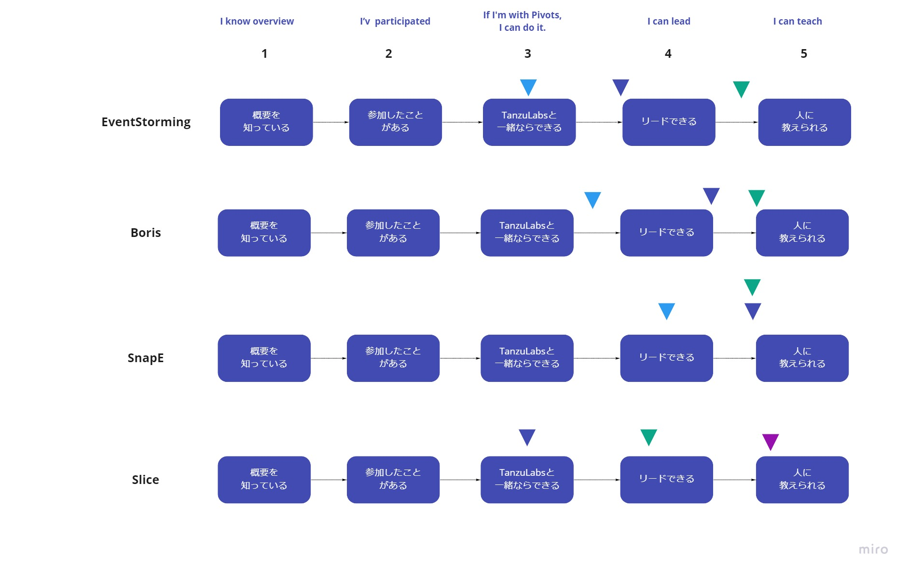

# OKRs

## 概要

OKRs（Objectives and Key Results）とは、目標管理の手法のひとつです。  
チームの目標（Objectives）と、目標達成のために必要な成果（Key Results）を結び付け、こまめにOKRsの進捗確認、フィードバックを行います。

- Step1：Objectivesの設定
  - 目標を設定します
- Step2：Key Resultsの設定
  - 目標達成のために必要な成果を設定します
- Step3：OKRsのチーム内共有
  - OKRsの内容をオープンにしておきます（Miroで進捗管理用のボードを作るetc）
- Step4：定期的なフィードバック
  - 目標を達成するまで、こまめに進捗確認とフィードバックを行います
    - 各メンバーにKey Resultsに対する達成度合を評価してもらいます
      - 評価の内訳はチーム内で決めます
    - 達成していない場合、原因分析を行い必要なアクションアイテムを抽出します

## なぜOKRs?
業務の優先順位を明確にし、効率良く目標を達成するのに効果的です。
目標を達成するための業務を明確にして、注力すべきタスクを把握しやすくなります。
また、チームの目標に対してメンバーがとるべき行動を明確にして意識を合わせることができます。

## OKRsのポイント
- Objectivesの設定のポイント
  - 容易に達成できるものではなく、「努力すれば達成できそう」ぐらいな高めの目標を設定することがポイントです
  - 目標達成までの期限は1～3ヶ月程度で設定すると良いです（期間を短くすることで、目標達成に向けた行動を明確にしやすい）
- Key Resultsの設定のポイント
  - 一般的には1つの目標に対して3つ程度の成果を設定します
  - 成果は具体的な行動に落とし込んだ内容を設定します
- OKRsの共有に関する心理的安全性
  - OKRsをオープンにすることが心理的安全性を損なうことにつながると感じられる場合、共有する範囲をチームや個人に絞ることも可能です（ただしアクションを行うにあたってメンバーの協力が得づらいことがデメリット）


**OKRsの設定例**
- Objectives：チームがSwift Methodを理解している
- Key Results：以下のSwift Methodの各アクティビティがチーム内で一人でも教えられる状態になる
  - Eventstorming
  - Boris
  - SnapE
  - Slices
- Key Resultsに対する評価の内訳
  - 1:アクティビティの概要を知っている
  - 2:アクティビティに参加したことがある
  - 3:有識者と一緒ならできる
  - 4:アクティビティをリードできる
  - 5:アクティビティを人に教えられる


